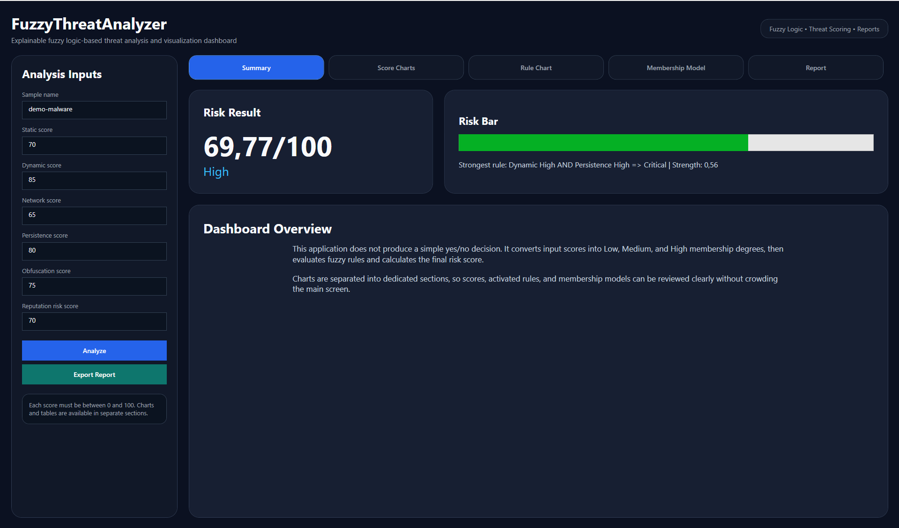
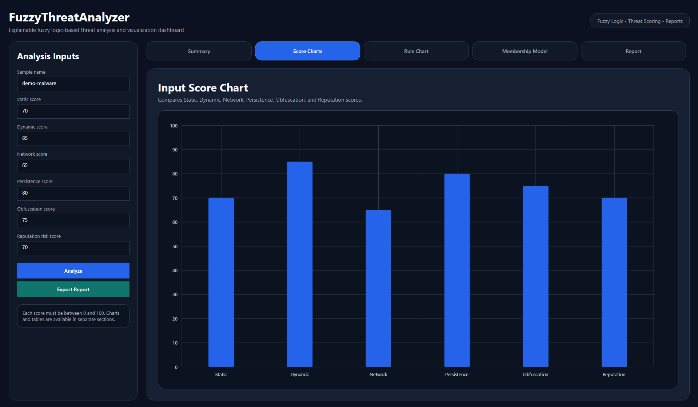
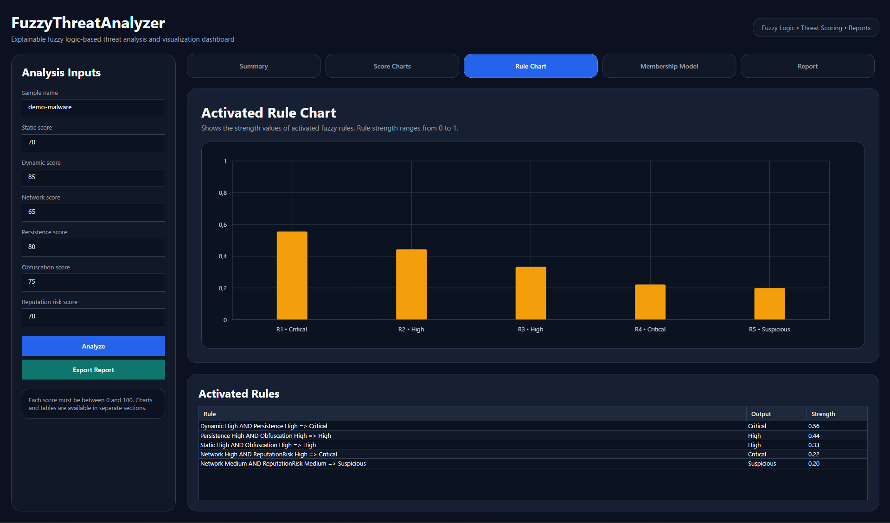
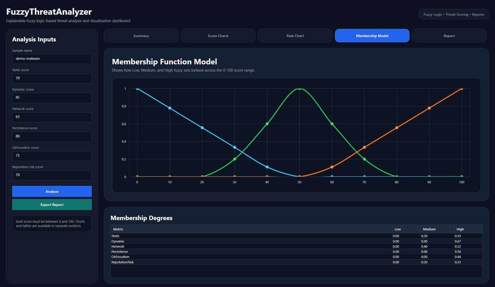
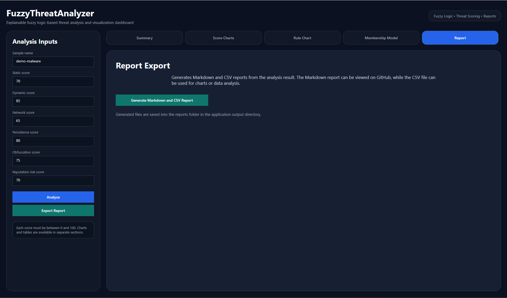

# FuzzyThreatAnalyzer

FuzzyThreatAnalyzer is an explainable threat analysis application that uses fuzzy logic to calculate cybersecurity risk scores from uncertain security indicators.

Instead of producing a strict `safe` or `malicious` decision, the system evaluates multiple cybersecurity-related inputs and generates an interpretable risk score, risk level, activated fuzzy rules, membership degrees, charts, and exportable reports.

The project includes:

* Fuzzy inference engine
* Command-line interface
* JSON sample input support
* WPF dashboard
* LiveCharts-based visualizations
* Markdown and CSV report export
* Unit tests
* Threat model documentation

---

## Dashboard Preview

FuzzyThreatAnalyzer includes a modern WPF dashboard for visual threat analysis.

### Summary

The summary view shows the final risk score, risk level, and strongest activated fuzzy rule.



### Input Score Chart

The score chart compares the main threat indicators such as static, dynamic, network, persistence, obfuscation, and reputation risk scores.



### Activated Rule Chart

The activated rule chart shows which fuzzy rules were triggered and how strong each rule activation was.



### Membership Function Model

The membership model visualizes how the Low, Medium, and High fuzzy sets behave across the 0-100 score range.



### Report Export

The report section allows exporting Markdown and CSV reports from the current analysis result.



---

## Why Fuzzy Logic?

Cybersecurity decisions are often uncertain.

A suspicious file may not be completely safe or completely malicious. It may have medium static indicators, high runtime behavior, suspicious network activity, and moderate reputation risk.

Traditional binary logic is not ideal for this type of decision-making.

Fuzzy logic allows the system to work with degrees of membership such as:

```text
Low: 0.00
Medium: 0.60
High: 0.11
```

This makes the analysis more explainable and closer to real-world threat assessment.

---

## Features

* Fuzzy logic based threat scoring
* Mamdani-style fuzzy inference approach
* Static, dynamic, network, persistence, obfuscation, and reputation risk inputs
* Low, Suspicious, High, and Critical risk levels
* Activated fuzzy rule explanation
* Interactive CLI mode
* JSON sample input support
* WPF dashboard interface
* LiveCharts-based visualizations
* Input score chart
* Activated rule strength chart
* Membership function chart
* Markdown threat report export
* CSV metrics export
* Unit tests for fuzzy logic behavior

---

## Technologies Used

| Technology  | Purpose                     |
| ----------- | --------------------------- |
| C#          | Main programming language   |
| .NET        | Application platform        |
| WPF         | Desktop dashboard interface |
| LiveCharts2 | Chart visualizations        |
| SkiaSharp   | Chart rendering backend     |
| xUnit       | Unit testing                |
| Markdown    | Report export               |
| CSV         | Metrics export              |

---

## Project Structure

```text
FuzzyThreatAnalyzer/
├── FuzzyThreatAnalyzer.Core/
│   ├── Engine/
│   ├── Fuzzy/
│   ├── Models/
│   └── Rules/
│
├── FuzzyThreatAnalyzer.Cli/
│   └── Program.cs
│
├── FuzzyThreatAnalyzer.Reporting/
│   └── ThreatReportExporter.cs
│
├── FuzzyThreatAnalyzer.App/
│   ├── MainWindow.xaml
│   └── MainWindow.xaml.cs
│
├── FuzzyThreatAnalyzer.Tests/
│
├── samples/
│   ├── low-risk-sample.json
│   ├── suspicious-sample.json
│   └── critical-sample.json
│
├── docs/
│   ├── threat-model.md
│   └── screenshots/
│       ├── dashboard-summary.png
│       ├── dashboard-score-charts.png
│       ├── dashboard-rule-chart.png
│       ├── dashboard-membership-model.png
│       └── dashboard-report-export.png
│
└── README.md
```

---

## Architecture

The project is separated into focused layers.

| Project                         | Responsibility                                                |
| ------------------------------- | ------------------------------------------------------------- |
| `FuzzyThreatAnalyzer.Core`      | Fuzzy sets, membership functions, rules, and inference engine |
| `FuzzyThreatAnalyzer.Cli`       | Command-line execution and JSON input support                 |
| `FuzzyThreatAnalyzer.Reporting` | Markdown and CSV report generation                            |
| `FuzzyThreatAnalyzer.App`       | WPF dashboard and chart visualizations                        |
| `FuzzyThreatAnalyzer.Tests`     | Unit tests for fuzzy logic and inference behavior             |

---

## Input Metrics

Each input metric is scored between `0` and `100`.

| Metric                | Description                                                       |
| --------------------- | ----------------------------------------------------------------- |
| Static Score          | Suspicious indicators found during static analysis                |
| Dynamic Score         | Runtime behavior such as process, registry, or file activity      |
| Network Score         | Network activity, suspicious destinations, or unusual connections |
| Persistence Score     | Startup, service, scheduled task, or other persistence behavior   |
| Obfuscation Score     | Packing, encryption, anti-debug, or code hiding behavior          |
| Reputation Risk Score | Risk based on hash, IP, domain, or external reputation signals    |

---

## Risk Levels

| Risk Score | Risk Level |
| ---------: | ---------- |
|     0 - 24 | Low        |
|    25 - 49 | Suspicious |
|    50 - 74 | High       |
|   75 - 100 | Critical   |

---

## Example Fuzzy Rules

```text
IF Dynamic is High AND Persistence is High THEN Threat is Critical

IF Network is High AND ReputationRisk is High THEN Threat is Critical

IF Static is High AND Obfuscation is High THEN Threat is High

IF Dynamic is Medium AND Static is Medium THEN Threat is Suspicious

IF Static is Low AND Dynamic is Low AND Network is Low THEN Threat is Low
```

---

## How to Run

### Run the WPF Dashboard

```powershell
dotnet run --project .\FuzzyThreatAnalyzer.App\FuzzyThreatAnalyzer.App.csproj
```

The dashboard allows manual score entry, fuzzy inference execution, chart visualization, rule inspection, and report export.

---

### Run with Interactive CLI Input

```powershell
dotnet run --project .\FuzzyThreatAnalyzer.Cli\FuzzyThreatAnalyzer.Cli.csproj
```

The CLI will ask for each score manually:

```text
Sample name:
Static score (0-100):
Dynamic score (0-100):
Network score (0-100):
Persistence score (0-100):
Obfuscation score (0-100):
Reputation risk score (0-100):
```

---

### Run with a JSON Sample

```powershell
dotnet run --project .\FuzzyThreatAnalyzer.Cli\FuzzyThreatAnalyzer.Cli.csproj -- .\samples\critical-sample.json
```

---

## Sample JSON Input

```json
{
  "sampleName": "critical-sample",
  "staticScore": 85,
  "dynamicScore": 90,
  "networkScore": 80,
  "persistenceScore": 88,
  "obfuscationScore": 75,
  "reputationRiskScore": 90
}
```

---

## Example CLI Output

```text
FuzzyThreatAnalyzer
-------------------

Analysis Result
-------------------
Sample: critical-sample
Risk Score: 82.45/100
Risk Level: Critical

Input Memberships
-------------------
Static
  Low: 0.00
  Medium: 0.00
  High: 0.67

Dynamic
  Low: 0.00
  Medium: 0.00
  High: 0.78

Activated Rules
-------------------
Network High AND ReputationRisk High => Critical
  Output: Critical
  Strength: 0.56

Dynamic High AND Persistence High => Critical
  Output: Critical
  Strength: 0.73
```

---

## Report Export

After each analysis, the application can generate:

```text
reports/threat-report.md
reports/threat-metrics.csv
```

The Markdown report contains:

* Summary
* Input scores
* Membership degrees
* Activated fuzzy rules

The CSV export contains structured metrics that can be used for charts, dashboards, or future analysis features.

---

## Tests

Run all tests with:

```powershell
dotnet test
```

The test project validates:

* Triangular membership function behavior
* Low risk inference behavior
* Suspicious risk inference behavior
* Critical risk inference behavior
* Score validation for invalid inputs

---

## Documentation

Additional design documentation is available in:

```text
docs/threat-model.md
```

This document explains the scoring model, membership functions, rule base, inference flow, current limitations, and planned improvements.

---

## Roadmap

Planned improvements:

* Configurable membership functions
* Configurable fuzzy rule files
* Real static analysis feature extraction
* Real dynamic sandbox behavior input
* VirusTotal or similar reputation integration
* HTML report export
* PDF report export
* More advanced chart models
* Exportable dashboard screenshots
* Dashboard theme improvements

---

## Disclaimer

This project is designed for educational and portfolio purposes.

It does not replace professional malware analysis tools, sandbox systems, EDR products, or threat intelligence platforms.

---

> [!WARNING]
> This project was developed with the assistance of artificial intelligence. I'm open to your ideas, suggestions, and feedback.
> 📧 non.mrbora@gmail.com
